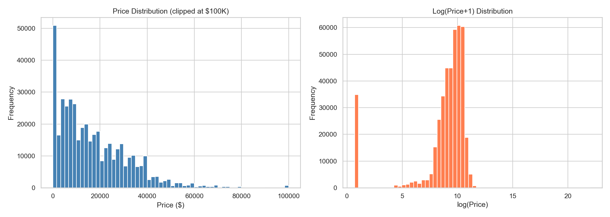
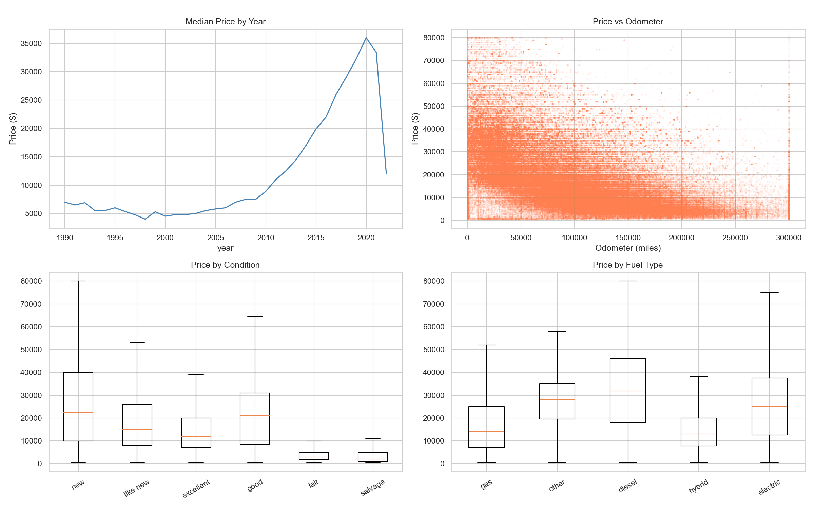
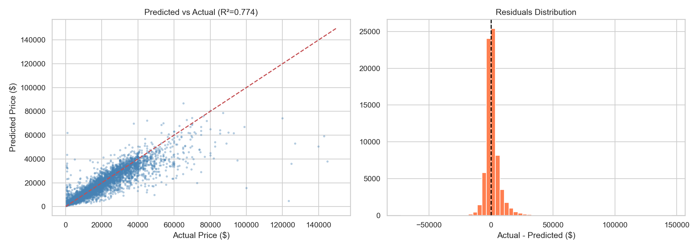
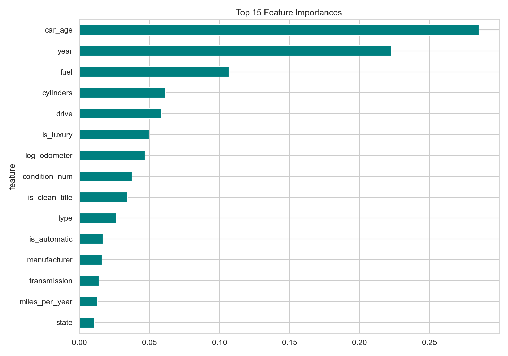
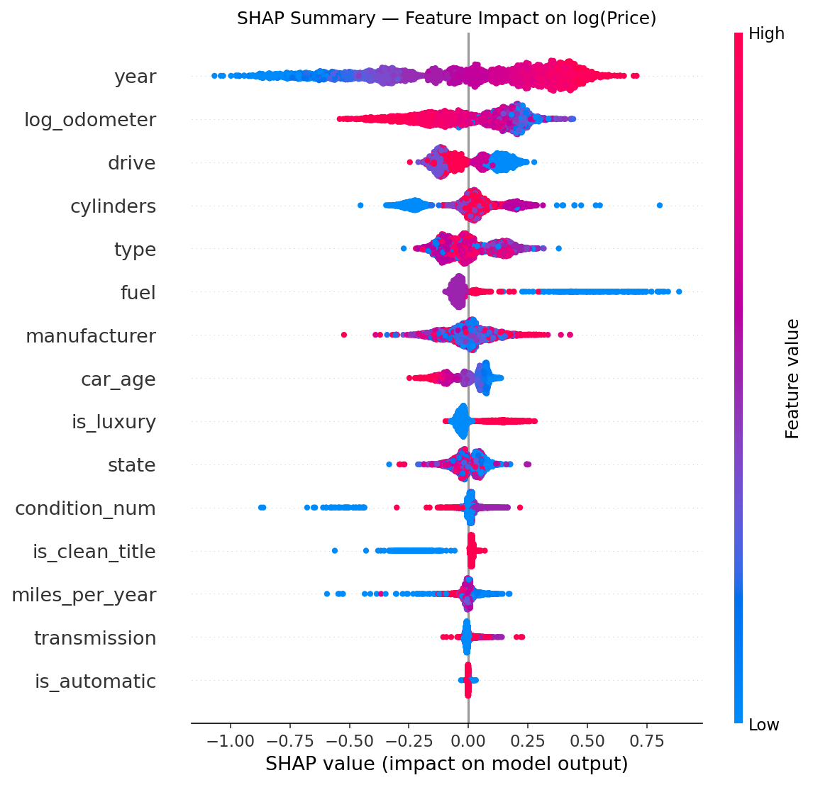
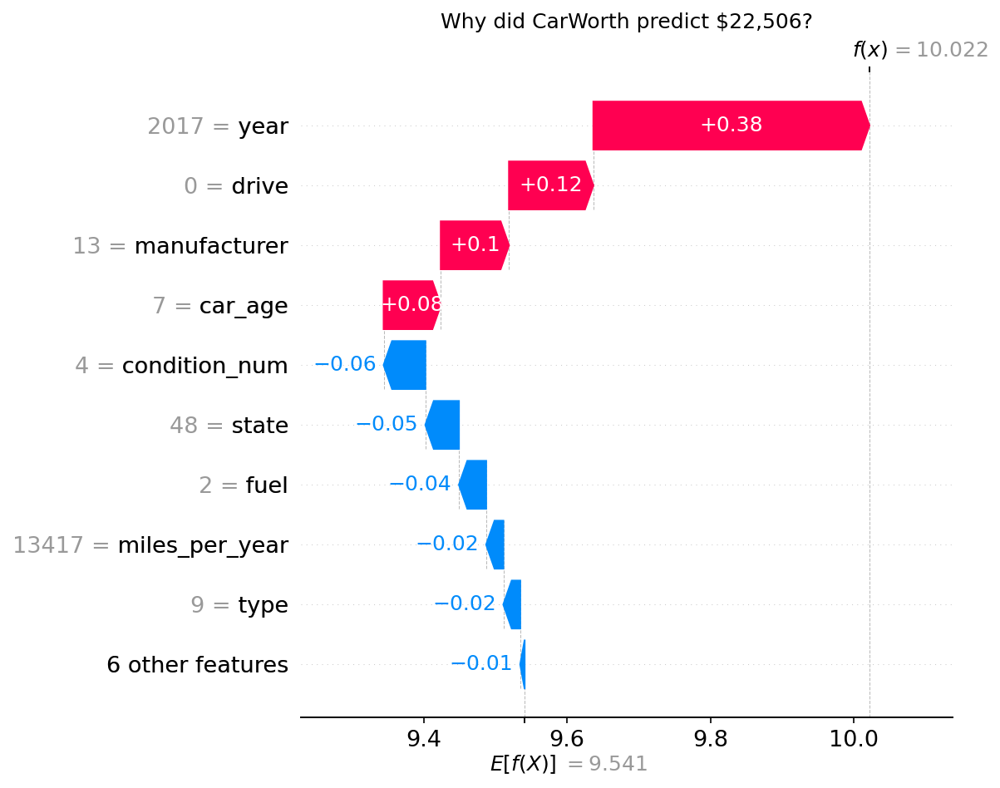

# CarWorth — Used Car Price Estimator

Predict the **market value of a used car** in the USA using structured listing data — and understand *why* the model made that prediction with **SHAP explainability**.  
Built as a **full ML pipeline** with an interactive **Streamlit** app.

---

## 🧠 Project Overview

**Goal:** Train an XGBoost regression model to estimate used car prices from features like mileage, year, manufacturer, and condition — trained on real Craigslist listings.

| Module | Description |
|---|---|
| `notebooks/01_eda.ipynb` | Exploratory data analysis — distributions, missing values, feature relationships |
| `notebooks/02_data_cleaning.ipynb` | Outlier removal, imputation, feature engineering |
| `notebooks/03_model_training.ipynb` | XGBoost training, evaluation, cross-validation |
| `notebooks/04_shap_analysis.ipynb` | SHAP global & per-prediction explainability |
| `src/app.py` | Streamlit web interface |
| `src/predict.py` | Inference logic — input encoding + model prediction |

---

## 📁 Project Structure

```
CarWorth/
│
├── src/
│   ├── app.py              # Streamlit app (main entry point)
│   └── predict.py          # Inference & encoding logic
│
├── notebooks/
│   ├── 01_eda.ipynb
│   ├── 02_data_cleaning.ipynb
│   ├── 03_model_training.ipynb
│   └── 04_shap_analysis.ipynb
│
├── scripts/
│   └── download_data.py    # Kaggle dataset downloader
│
├── data/
│   ├── raw/                # vehicles.csv (not committed — ~1.4 GB)
│   └── processed/          # vehicles_clean.csv (not committed)
│
├── models/                 # Trained artifacts (not committed)
│   ├── xgb_model.joblib
│   ├── encoders.joblib
│   ├── shap_explainer.joblib
│   └── metrics.json
│
├── assets/                 # Generated plots
├── requirements.txt
└── README.md
```

---

## 📸 Visuals

### Price Distribution


### Price vs Key Features


### Model Evaluation — Predicted vs Actual


### Feature Importance


### SHAP Global Summary


### SHAP Waterfall — Single Prediction


---

## 🧹 Data Cleaning & Feature Engineering

1️⃣ Drop irrelevant/high-missing columns (`county` >99%, `size` ~72%, `VIN`, `url`, etc.)  
2️⃣ Filter price outliers — keep **$500 – $150,000**  
3️⃣ Filter year: **1990–2024**, odometer: **0–350,000 miles**  
4️⃣ Fill missing categoricals with `'unknown'`, missing numerics with median  
5️⃣ Engineer new features:

- `car_age` = 2024 − year
- `miles_per_year` = odometer ÷ car_age
- `log_odometer` = log1p(odometer)
- `log_price` = log1p(price) — model target
- `is_luxury`, `is_clean_title`, `is_automatic` — binary flags
- `condition_num` — ordinal encoding (salvage=0 → new=5)

**Target:** `log_price` (inverse-transformed to $ for display)

---

## 📊 Model Performance

| Metric | Value |
|---|---|
| R² | 0.774 |
| MAE | $3,898 |
| RMSE | $6,954 |
| MAPE | 43.5% |

> Evaluated on 20% holdout set. Cross-validated with 5-fold KFold.

**Top features by importance:** `year`, `log_odometer`, `manufacturer`, `car_age`, `condition_num`, `drive`, `type`

---

## 🔍 SHAP Explainability

Each prediction is explained with a **SHAP waterfall plot** showing exactly which features pushed the price up or down.

- Global summary: beeswarm + mean |SHAP| bar chart
- Per-car: waterfall plot rendered live in the Streamlit app
- Dependence plots for top 4 features

---

## 🖥️ Streamlit App

Interactive UI where users fill in car details and get an instant price estimate with explanation.

```bash
streamlit run src/app.py
# open http://localhost:8501
```

**Inputs:** Manufacturer, year, odometer, condition, fuel, transmission, drive type, vehicle type, cylinders, title status, state  
**Output:** Estimated price with ±15% range + SHAP waterfall chart

---

## 🚀 How to Run

### 1) Install Dependencies

```bash
pip install -r requirements.txt
```

### 2) Download Dataset

Place your `kaggle.json` API key in `~/.kaggle/`, then:

```bash
python scripts/download_data.py
```

Or download manually from [Kaggle — Craigslist Vehicles](https://www.kaggle.com/datasets/austinreese/craigslist-carstrucks-data) and place `vehicles.csv` in `data/raw/`.

### 3) Run Notebooks in Order

```
01_eda.ipynb → 02_data_cleaning.ipynb → 03_model_training.ipynb → 04_shap_analysis.ipynb
```

### 4) Launch App

```bash
streamlit run src/app.py
```

---

## 💾 Dataset Information

- **Source:** Kaggle — Craigslist Used Cars USA
- **Link:** https://www.kaggle.com/datasets/austinreese/craigslist-carstrucks-data
- **Size:** ~426K listings, 26 columns
- **Coverage:** All 50 US states, listings from 2021

---

## 🧰 Tools & Technologies

| Category | Tools |
|---|---|
| Language | Python 3.10+ |
| Data | Pandas, NumPy |
| Modeling | XGBoost, Scikit-learn |
| Explainability | SHAP |
| Visualization | Matplotlib, Seaborn |
| App | Streamlit |
| Environment | Jupyter, VS Code |

---

## 👨‍💻 Author

**Berke Arda Türk**  
Data Science & AI Enthusiast | Computer Science (B.ASc)  
[🌐 Portfolio Website](https://berkeardaturk.com) • [💼 LinkedIn](https://www.linkedin.com/in/berke-arda-turk/) • [🐙 GitHub](https://github.com/Mood07)
